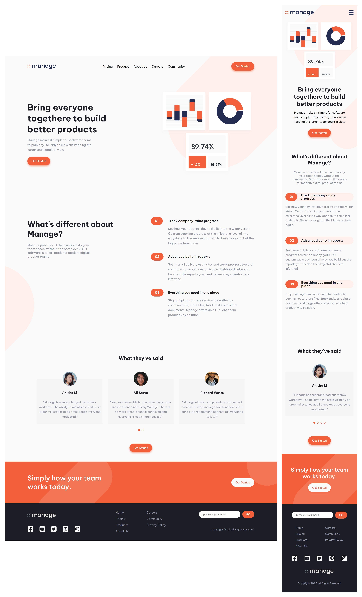

# Frontend Mentor - Manage landing page solution

This is my solution to the [Manage landing page challenge on Frontend Mentor](https://www.frontendmentor.io/challenges/manage-landing-page-SLXqC6P5)

## The challenge

Users should be able to:

- View the optimal layout for the site depending on their device's screen size
- See hover states for all interactive elements on the page
- See all testimonials in a horizontal slider
- Receive an error message when the newsletter sign up `form` is submitted if:
  - The `input` field is empty
  - The email address is not formatted correctly

## Links

- [Solution URL](https://www.frontendmentor.io/challenges/manage-landing-page-SLXqC6P5)
- [Live Site URL](https://jhon-okayda-manage-landing-page.netlify.app/)

## Built with

- Semantic HTML5 markup
- CSS Flexbox
- CSS Grid
- Mobile-first (Layout)
- SASS/SCSS
- React JS
- Swiper JS
- CSS Modules
- BEM

## Author

- Created by - okayda-jhon
